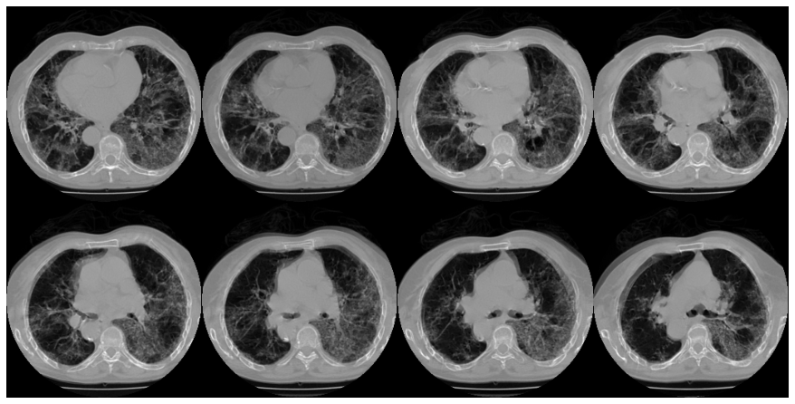

Practical sessions on image analysis using deep learning.

As part of the University Degree "AI and Healthcare" jointly organised by the Lille University and the Include team at Lille University Hospital, I gave two 4-hours-practical sessions on image analysis with deep learning. Those sessions were a mixed between an opening lecture on image analysis, some intuitions behind the theoretical elements studied during the lectures, and image analysis using Python from image reading to classifying Covid-19 related findings using CT-scans and Tensorflow. Students were mostly physician and clinical researchers willing to go into AI techniques.

You can find the GitHub repository of the pratical sessions [here](https://github.com/afiliot/TPDUIA). README and Ipython notebooks are written in French for more convenience.

_Figure : some CT-scan's slides from an infected patient (open-source data set available [here](https://www.medrxiv.org/content/10.1101/2020.05.20.20100362v1))._